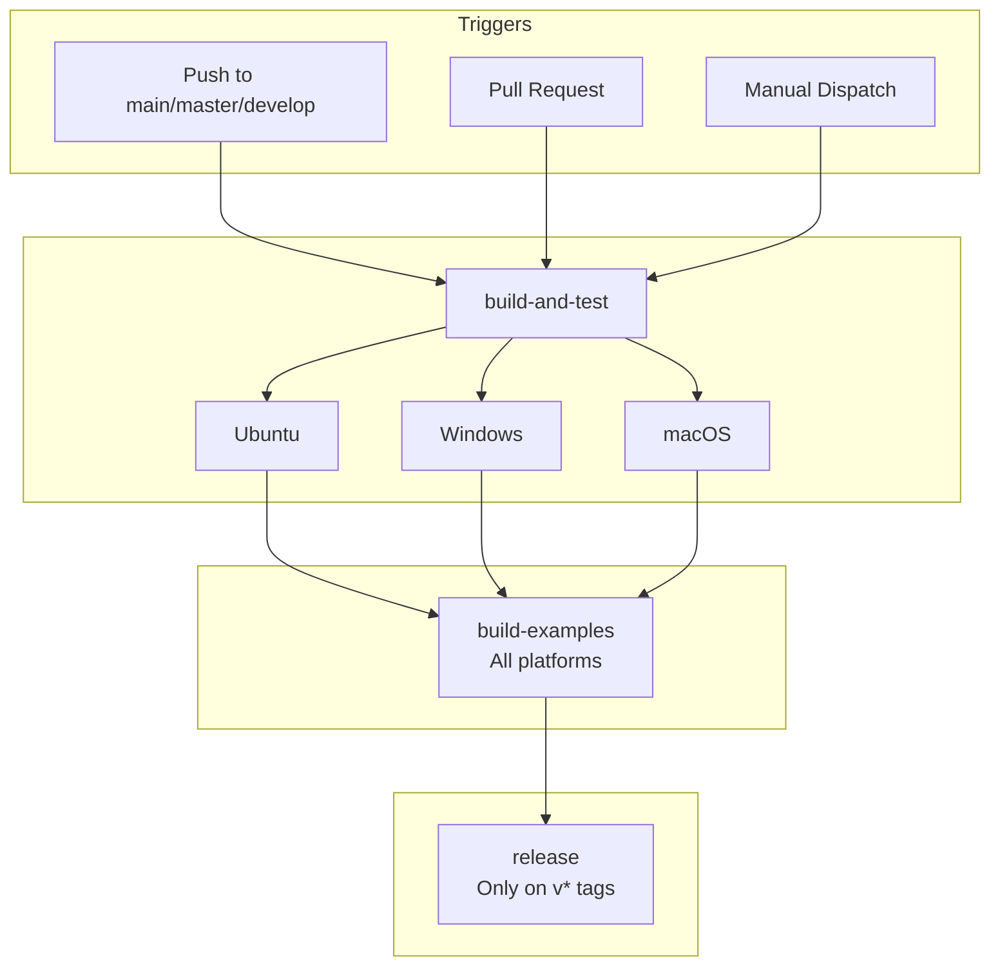

# DCPcrypt CI/CD Pipeline

This directory contains GitHub Actions workflow definitions for automated building, testing, and releasing of DCPcrypt.

## Workflow Overview

### ci.yml

The main continuous integration workflow that runs on every push and pull request.



```
┌─────────────────────────────────────────────────────────────┐
│                        TRIGGERS                             │
│  - Push to main, master, develop                            │
│  - Pull requests to main, master, develop                   │
│  - Manual workflow dispatch                                 │
└─────────────────────────┬───────────────────────────────────┘
                          │
                          v
┌─────────────────────────────────────────────────────────────┐
│                    build-and-test                            │
│                                                             │
│  Runs in PARALLEL on:                                       │
│  ┌─────────────┐ ┌─────────────┐ ┌─────────────┐           │
│  │   Ubuntu     │ │   Windows   │ │    macOS    │           │
│  └─────────────┘ └─────────────┘ └─────────────┘           │
│                                                             │
│  - Setup Lazarus/FPC compiler                               │
│  - Build all 5 test programs with fpc                       │
│  - Execute 282 tests                                        │
└─────────────────────────┬───────────────────────────────────┘
                          │
                          v
┌─────────────────────────────────────────────────────────────┐
│                    build-examples                            │
│                                                             │
│  Runs in PARALLEL on:                                       │
│  ┌─────────────┐ ┌─────────────┐ ┌─────────────┐           │
│  │   Ubuntu     │ │   Windows   │ │    macOS    │           │
│  └─────────────┘ └─────────────┘ └─────────────┘           │
│                                                             │
│  - Build 2 console examples with fpc                        │
│  - Build 2 GUI examples with lazbuild                       │
└─────────────────────────┬───────────────────────────────────┘
                          │
                          v  (only on v* tags)
                ┌─────────────────────┐
                │      release        │
                │                     │
                │  Creates GitHub     │
                │  release            │
                └─────────────────────┘
```

### Pipeline Stages

**Stage 1: build-and-test**
- Runs in parallel on Ubuntu, Windows, and macOS
- Sets up Lazarus/FPC compiler
- Builds all 5 test programs using `fpc` with `-Mdelphi` flag
- Executes all 282 tests
- No external dependencies required

**Stage 2: build-examples**
- Runs in parallel on Ubuntu, Windows, and macOS
- Builds 2 console examples with `fpc`
- Builds 2 GUI examples with `lazbuild` (requires LCL)
- Linux requires GTK2 development headers for GUI builds

**Stage 3: release**
- Only triggered on version tags (v*)
- Creates GitHub release with auto-generated notes

## Jobs Description

| Job | Runs On | Dependencies | Purpose |
|-----|---------|--------------|---------|
| `build-and-test` | Ubuntu, Windows, macOS | None | Core build and test validation |
| `build-examples` | Ubuntu, Windows, macOS | `build-and-test` | Verify all examples compile |
| `release` | Ubuntu | `build-and-test`, `build-examples` | Create GitHub release (tags only) |

## Test Suites

| Test Program | Tests | Coverage |
|--------------|-------|----------|
| `test_hashes` | 90 | SelfTest, digest correctness, determinism, Burn for all 10 hashes |
| `test_ciphers` | 139 | SelfTest, encrypt/decrypt roundtrip, Burn, properties for all 20 ciphers |
| `test_block_modes` | 28 | ECB, CBC, CFB8bit, CFBblock, OFB, CTR for Rijndael and Blowfish |
| `test_base64` | 11 | Encode/decode roundtrips, RFC 4648 known values, binary data |
| `test_stream_encrypt` | 14 | Salt+IV stream encryption, PartialEncryptStream, OnProgressEvent |

**Total: 282 tests**

## Examples

| Example | Type | Build Tool |
|---------|------|------------|
| `demo_encrypt_string` | Console | `fpc` |
| `demo_file_encrypt` | Console | `fpc` |
| `EncryptStringsViaEncryptStream` | GUI (LCL) | `lazbuild` |
| `EncryptFileUsingThread` | GUI (LCL) | `lazbuild` |

## Platform Dependencies

### Linux (Ubuntu)

```bash
# GUI examples only
libgtk2.0-0           # GTK2 runtime
libgtk2.0-dev         # GTK2 headers (for LCL compilation)
```

Tests and console examples have no external dependencies.

### Windows

- No additional dependencies
- FPC produces `.exe` binaries automatically

### macOS

- No additional dependencies
- LCL uses Cocoa backend

## Environment Variables

| Variable | Value | Description |
|----------|-------|-------------|
| `LAZARUS_VERSION` | `stable` | Lazarus/FPC version to install |
| `FPCFLAGS` | `-Mdelphi -FEtests -Fusrc -Fusrc/Ciphers -Fusrc/Hashes -Futests` | FPC compiler flags for test programs |

## Triggering Workflows

### Automatic Triggers

- **Push**: Any push to `main`, `master`, or `develop` branches
- **Pull Request**: Any PR targeting `main`, `master`, or `develop`

### Manual Trigger

1. Navigate to **Actions** tab in GitHub
2. Select **CI** workflow
3. Click **Run workflow**
4. Select branch and confirm

### Release Trigger

Releases are created automatically when pushing version tags:

```bash
git tag v2.0.5
git push origin v2.0.5
```

## Local Testing

Run the same tests locally using the Makefile:

```bash
make build            # compile all test programs
make test             # build and run all tests
make build-examples   # compile all examples (console + GUI)
make build-all        # compile everything (tests + examples)
make check            # clean, build and run (full verification)
make info             # show project information
```

Or manually:

```bash
# Build
fpc -Mdelphi -FEtests -Fusrc -Fusrc/Ciphers -Fusrc/Hashes -Futests tests/test_hashes.lpr

# Run
tests/test_hashes
```

## Troubleshooting

### Build Failures

| Issue | Solution |
|-------|----------|
| `Identifier not found: Result` | Ensure `-Mdelphi` flag is used (dcpbase64.pas requires Delphi mode) |
| Lazarus version mismatch | Ensure `LAZARUS_VERSION` is compatible |
| GTK2 not found (Linux GUI) | Install `libgtk2.0-dev` |

### Test Failures

| Issue | Solution |
|-------|----------|
| Gost SelfTest warning | Known upstream issue - test vectors don't match implementation. Encrypt/decrypt roundtrip works correctly. |
| Binary not found | Check that `-FEtests` flag places binaries in `tests/` directory |

## See Also

- [docs/README.md](../../docs/README.md) - Project documentation
- [docs/CHANGELOG.md](../../docs/CHANGELOG.md) - Version history
- [GitHub Actions Documentation](https://docs.github.com/en/actions)
- [setup-lazarus Action](https://github.com/gcarreno/setup-lazarus)
